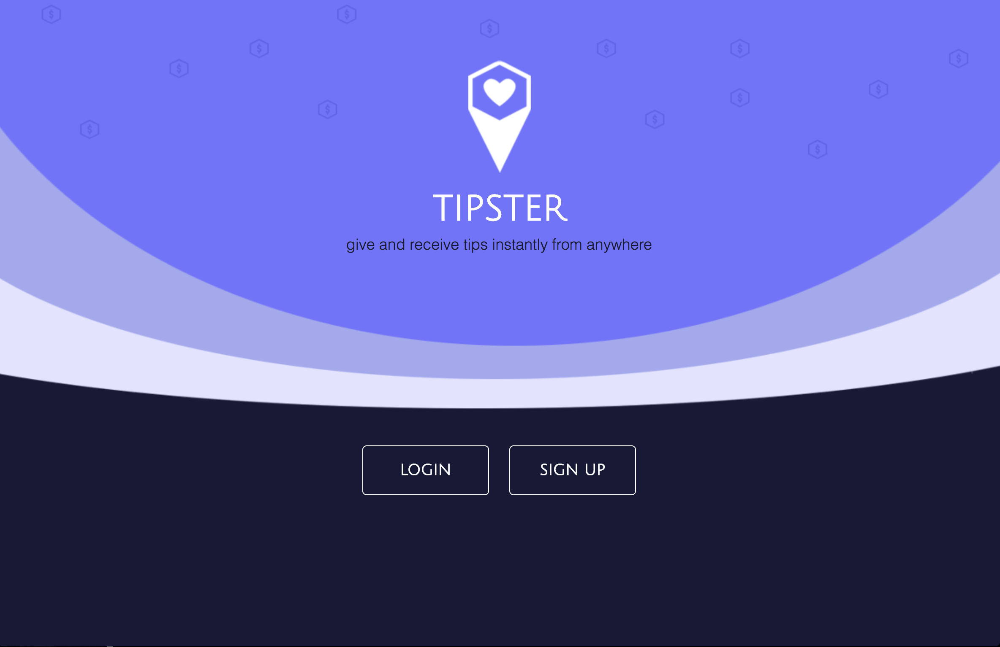

# TIPSTER
Tipster allows you to thank your service providers without the hassle of cash or the awkwardness of a physical transaction.

*[tipster live](https://gettipster.io) coming soon!*

## Motivation
Have you ever wanted to show someone gratitude for a service but are unable to due to lack of cash on hand or the option to tip just wasn’t available. Lets face it we have all been there and thats why the tipster team to came together to create a platform for giving back.

## Getting Started

These instructions will get you a copy of the project up and running on your local machine.

### Installing

Clone to a local repository. Enjoy!
`npm i` for root and  `yarn` for client

## Usage

* run `node bin/www` and `yarn start`

* view from yarn `localhost:3000`

* `stripe` and `twilio` keys are not provided

## Built With
Required packages for server:
* [axios](https://www.npmjs.com/package/body-parser) - Promise based HTTP request library
* [bcrypt](https://www.npmjs.com/package/bcrypt)
* [body-parser](https://www.npmjs.com/package/body-parser)
* [connect-flash](https://www.npmjs.com/package/connect-flash)
* [cookie-parser](https://www.npmjs.com/package/cookie-parser)
* [express](https://www.npmjs.com/package/express)
* [express-session](https://www.npmjs.com/package/express-session)
* [method-override](https://www.npmjs.com/package/method-override)
* [morgan](https://www.npmjs.com/package/morgan) - HTTP Logger
* [passport](https://www.npmjs.com/package/passport) - Login System
* [passport-local](https://www.npmjs.com/package/passport-local) - Local Login Strategy
* [pg](https://www.npmjs.com/package/pg) - Postgresql Database
* [sequelize](https://www.npmjs.com/package/sequelize) - ORM
* [stripe](https://www.npmjs.com/package/stripe) - Payments Processor 
* [twilio](https://www.npmjs.com/package/twilio) - SMS Notifications

### Additions

