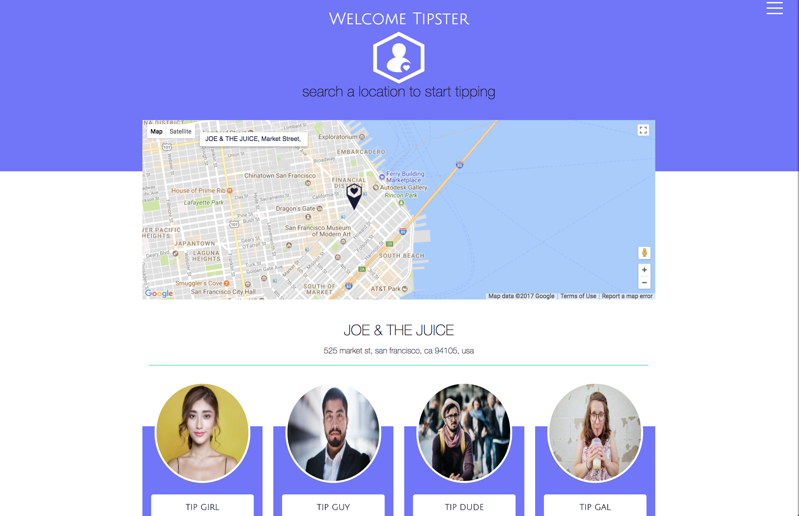
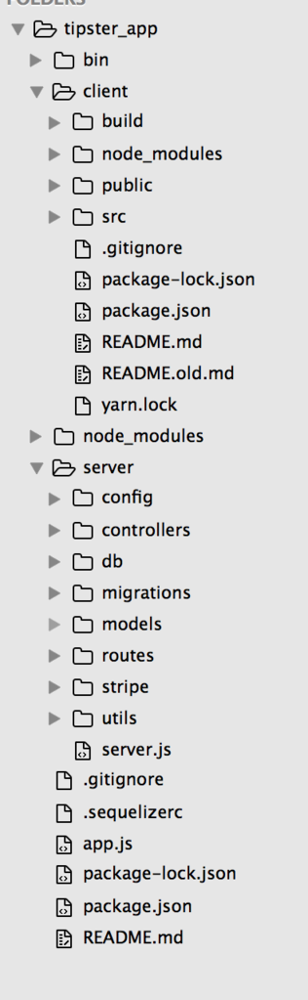

# TIPSTER
Tipster allows you to thank your service providers without the hassle of cash or the awkwardness of a physical transaction.


*[tipster live](https://gettipster.io) coming soon!*

## Motivation
Have you ever wanted to show someone gratitude for a service but are unable to due to lack of cash on hand or the option to tip just wasn’t available. Lets face it we have all been there and thats why the tipster team to came together to create a platform for giving back.




## Getting Started

These instructions will get you a copy of the project up and running on your local machine.



### Installing

Clone to a local repository. Enjoy!
`npm i` for root and  `yarn` for client


## Usage

* run `node bin/www` and `yarn start`

* view from yarn `localhost:3000`

// * `stripe` and `twilio` keys are not provided

## Built With
Required packages for server:
* [axios](https://www.npmjs.com/package/body-parser) - Promise based HTTP request library
* [bcrypt](https://www.npmjs.com/package/bcrypt)
* [body-parser](https://www.npmjs.com/package/body-parser)
* [connect-flash](https://www.npmjs.com/package/connect-flash)
* [cookie-parser](https://www.npmjs.com/package/cookie-parser)
* [express](https://www.npmjs.com/package/express)
* [express-session](https://www.npmjs.com/package/express-session)
* [method-override](https://www.npmjs.com/package/method-override)
* [morgan](https://www.npmjs.com/package/morgan) - HTTP Logger
* [passport](https://www.npmjs.com/package/passport) - Login System
* [passport-local](https://www.npmjs.com/package/passport-local) - Local Login Strategy
* [pg](https://www.npmjs.com/package/pg) - Postgresql Database
* [sequelize](https://www.npmjs.com/package/sequelize) - ORM
* [stripe](https://www.npmjs.com/package/stripe) - Payments Processor 
* [twilio](https://www.npmjs.com/package/twilio) - SMS Notifications

### Additions
```search Page 
 constructor(props){
    super(props);
    const that = this;
    fetch("/api/search", {
      method: 'GET',
      credentials: 'include',
      mode: 'cors'
    })
    .then(function(res){
      const contentType = res.headers.get("content-type");
      if(contentType && contentType.includes("application/json")) {
        return res.json();
      }
    })
    .then(function(json){
      that.setState({currentUser:{username:json.username, image:json.image }});
    })
    .catch(function(res){
      if(res.error_code && res.error_code == 'invalid_login' ){
        document.cookie = ""; // clear cookie
        window.location.href = "/" // redirect to login
      }
      console.log("error", res);
    })
  }


  Stripe Checkout
  class _CardForm extends Component {
  handleSubmit = ev => {
    ev.preventDefault();
    this.props.stripe.createToken()
    .then((payload) => {
      console.log(payload);
      console.log(`token id: ${payload.token}`);
      this.props.tip(payload.token);
    });
  };


  Tip Card
  submitTip = (token) => {
    let transaction = {
      location: this.props.location,
      recipient: this.props.username,
      amount: this.state.amount,
      anonymous: this.state.anonymous,
      note: this.state.note,
      token: token
    }
    tipHelper(transaction);
    this.resetState();
  }
 
 
www
db.sequelize.sync({}).then(function() {
  app.listen(port, function() {
    console.log("App listening on PORT " + port);
  });
});


User Model
'use strict';
const uuidv1   = require('uuid/v1');

module.exports = (sequelize, DataTypes) => {
  const User   = sequelize.define('User', {
    uuid: {
      primaryKey: true,
      type: DataTypes.UUID,
      defaultValue: DataTypes.UUIDV1,
      isUnique :true
    },
    ,{
      hooks: {
        beforeCreate: user => {
          const emailArr = user.email.split("@");
          user.username = emailArr[0] + Math.random().toString(36).substring(7);
      }
    }
  });
// methods ======================
  User.associate = models => {
    User.belongsToMany(models.Location, { 
      as: 'WorkPlace',
      through: 'UserLocations',
      foreignKey: 'UserUUID'
    }),
    User.belongsTo(models.StripeCustomer, {
      foreignKey: 'fk_StripeCustomer',
      onDelete: 'CASCADE'
    });
    User.belongsTo(models.StripeConnect, { 
      foreignKey: 'fk_StripeConnect',
      onDelete: 'CASCADE'
    });
  }

  return User;
};


Signup / Login
app.post('/login', (req, res, next) => {
  passportAuthenticate('local-login', req, res, next);
});
// process the signup form
app.post('/signup', (req, res, next) => {
  passportAuthenticate('local-signup', req, res, next);
});


Stripe
charge: (req, sender, recip, func) => {
    let chargeObject = {
      amount: req.body.amount * 100, //need to convert to cents
      currency: "usd",
      description: `Tip to ${req.body.recipient}for $${req.body.amount} at ${req.body.location.name}\nNote: ${req.body.note}`,
      metadata: {
        for: recip.username
      },
      receipt_email: sender.email,
      customer: sender['StripeCustomer'].dataValues.key
    }
    stripe.charges.create(chargeObject,
      function(err, charge) {
      // asynchronously called
      if (err) {
        throw err;
        console.log(`error`);
      }
      func(charge); 
    });
  }
  
  
Stripe Connect 
StripeConnect.create({
    accessToken: response.data.access_token,
    livemode: response.data.livemode,
    refreshToken: response.data.refresh_token,
    publishableKey: response.data.stripe_publishable_key,
    connectUserId: response.data.stripe_user_id,
  })
  .then(function(connectedUser){
    console.log(connectedUser, account)
    User.update({ 
      firstName: account.legal_entity.first_name,
      email: account.legal_entity.phone_number,
      phone:account.email,
      fk_StripeConnect: connectedUser.dataValues.uuid},
      { where: { username:  stripeState} })
    .then(function(response){
        console.log(response);
        res.cookie('connect_id', true); // update cookie to note this user has a connect ID now.
        res.redirect("http://localhost:3000/rec/history")
      })
      

Twillio
var client = new twilio(accountSid, authToken);

client.messages.create({
    body: 'You have received a new tip on Tipster',
    to: req.body.number,  // Text this number
    from: '+12345678901' // From a valid Twilio number
})
.then((message) => console.log(message.sid));```

```


## Authors

participant of this project.

* [Sahil Najeeb](https://github.com/Sahil-N)
* [Derrick Lee](https://github.com/FEEDKurumu)
* [Justin Wong](https://github.com/jwong1219)
* [Amber Burroughs](https://github.com/AmberLBurroughs)
